# TaskFlow API — Jenkins DevOps Pipeline

**SIT753 · 7.3HD · Nithin Allaagari (226571998)**

TaskFlow is a task-management REST API (Node.js/Express) with JWT authentication, per-user CRUD, filtering/sorting, statistics, and Prometheus instrumentation. It is delivered by a 7-stage Jenkins pipeline in which every stage is an automated quality gate:

```mermaid
flowchart LR
    GH[GitHub push] -->|pollSCM| B[1 Build<br/>Docker image + registry]
    B --> T[2 Test<br/>Jest unit + integration<br/>coverage gate]
    T --> Q[3 Code Quality<br/>ESLint + SonarQube<br/>quality gate]
    Q --> S[4 Security<br/>npm audit + Trivy<br/>fs / secrets / image]
    S --> D[5 Deploy<br/>staging + E2E<br/>auto-rollback]
    D --> R[6 Release<br/>promote image, prod,<br/>smoke test, git tag]
    R --> M[7 Monitoring<br/>Prometheus, Grafana,<br/>Alertmanager]
    M -.alerts.-> A[Team alert channel]
```



| Stage | Tools | Gate (fails the build when…) |
|---|---|---|
| Build | npm ci, Docker multi-stage build, private registry | build fails; image tagged `<version>-<build>-<sha>` and pushed with build metadata |
| Test | Jest, Supertest, jest-junit, Jenkins Coverage plugin | any test fails or coverage < 85% lines / 75% branches |
| Code Quality | ESLint (complexity rules), SonarQube + custom "TaskFlow Gate" | lint errors, or gate fails (coverage < 80%, duplication > 3%, rating worse than A) |
| Security | npm audit, Trivy (deps, secrets, Dockerfile misconfig, image) | any fixable HIGH/CRITICAL finding |
| Deploy | Docker Compose, deploy.sh health verification, Jest E2E | new release unhealthy → automatic rollback; E2E failure |
| Release | Image promotion, Docker Compose, smoke tests, git tag | production unhealthy → rollback; smoke test failure |
| Monitoring | Prometheus, Alertmanager, Grafana, alert receiver | monitoring stack or production target not healthy |

---

## 1. Prerequisites

- Docker Desktop (Windows/macOS) or Docker Engine + Compose v2 (Linux), with **≥ 6 GB RAM** allocated (SonarQube is memory hungry)
- Git, plus Node.js 22 on your machine (only needed once, to generate `package-lock.json`)
- A GitHub account and a **Personal Access Token** (classic: `repo` scope, or fine-grained: Contents read/write)

## 2. Put the code on GitHub

```bash
cd taskflow-api
npm install                      # generates package-lock.json (required by npm ci + Docker build)
npm test                         # optional: run the tests locally
git init && git add . && git commit -m "Initial commit: TaskFlow API + Jenkins pipeline"
git branch -M main
git remote add origin https://github.com/<your-username>/taskflow-api.git
git push -u origin main
```

If the repository is private, add your **marker and the unit chair** as collaborators (Settings → Collaborators).

## 3. Start the DevOps platform (Jenkins + SonarQube + registry)

```bash
docker compose -f jenkins/docker-compose.yml up -d --build    # first build takes a few minutes
docker exec jenkins cat /var/jenkins_home/secrets/initialAdminPassword
```

- Jenkins → http://localhost:8080 — paste the password, choose **Install suggested plugins** (the pipeline plugins are already pre-installed), create your admin user.
- SonarQube → http://localhost:9000 — log in `admin`/`admin` and set a new password.

## 4. Configure SonarQube (as code)

1. SonarQube → **My Account → Security → Generate Token** (type *User*, name `setup`). Copy it.
2. Run the setup script from the repo root:
   ```bash
   SONAR_ADMIN_TOKEN=<that token> bash scripts/sonar-setup.sh
   ```
   This creates the project, the custom **TaskFlow Gate**, the "new code" definition and the webhook to Jenkins.
3. Generate a second token for Jenkins: **Generate Token → type *Global Analysis Token***, name `jenkins`. Copy it.

## 5. Configure Jenkins

**Credentials** — *Manage Jenkins → Credentials → System → Global → Add Credentials*:

| ID | Kind | Value |
|---|---|---|
| `sonarqube-token` | Secret text | the SonarQube *jenkins* token |
| `taskflow-jwt-staging` | Secret text | a random 64-char string (`openssl rand -hex 32`) |
| `taskflow-jwt-prod` | Secret text | a **different** random 64-char string |
| `taskflow-chaos-token` | Secret text | a random string ≥ 16 chars (`openssl rand -hex 16`) |
| `github-creds` | Username with password | GitHub username + Personal Access Token |

**SonarQube server** — *Manage Jenkins → System → SonarQube servers*: tick *Environment variables*, **Add SonarQube** with Name `SonarQube`, URL `http://sonarqube:9000`, token `sonarqube-token`. Save.

**Pipeline job** — *New Item* → name `taskflow-pipeline` → **Pipeline** →
- Definition: *Pipeline script from SCM*, SCM: *Git*
- Repository URL: `https://github.com/<you>/taskflow-api.git` (HTTPS), Credentials: `github-creds`
- Branch: `*/main`, Script Path: `Jenkinsfile` → **Save** → **Build Now**

The first build registers the parameters; afterwards use **Build with Parameters**. Every push to `main` triggers the pipeline automatically within ~2 minutes.

## 6. What's running

| Service | URL |
|---|---|
| Jenkins | http://localhost:8080 |
| SonarQube | http://localhost:9000 |
| TaskFlow **production** | http://localhost:3000/health |
| TaskFlow **staging** | http://localhost:3001/health |
| Grafana (admin/admin) | http://localhost:3002 → *TaskFlow API – Service Overview* |
| Prometheus | http://localhost:9090 (Status → Targets, Alerts) |
| Alertmanager | http://localhost:9093 |
| Team alert channel (history) | http://localhost:5001 · live: `docker logs -f alert-receiver` |
| Image registry | http://localhost:5050/v2/taskflow-api/tags/list |

Try the API:
```bash
curl -s -X POST localhost:3000/api/auth/register -H 'Content-Type: application/json' -d '{"email":"demo@example.com","password":"Password123!"}'
TOKEN=$(curl -s -X POST localhost:3000/api/auth/login -H 'Content-Type: application/json' -d '{"email":"demo@example.com","password":"Password123!"}' | jq -r .token)
curl -s -X POST localhost:3000/api/tasks -H "Authorization: Bearer $TOKEN" -H 'Content-Type: application/json' -d '{"title":"Record HD demo","priority":"high","dueDate":"2026-10-20"}'
curl -s localhost:3000/api/tasks/stats -H "Authorization: Bearer $TOKEN"
```

### API reference

| Method | Path | Auth | Purpose |
|---|---|---|---|
| POST | `/api/auth/register` | – | create account (email, password 8–128 chars) |
| POST | `/api/auth/login` | – | returns JWT (rate limited) |
| GET | `/api/auth/me` | JWT | current user |
| GET | `/api/tasks?status=&priority=&sort=priority\|dueDate` | JWT | list own tasks |
| POST | `/api/tasks` | JWT | create task |
| GET/PATCH/DELETE | `/api/tasks/:id` | JWT | read / update / delete own task |
| GET | `/api/tasks/stats` | JWT | counts by status, overdue, completion rate |
| GET | `/health`, `/ready`, `/metrics` | – | liveness, readiness, Prometheus metrics |

## 7. Drills for the demo (Top-HD evidence)

- **Rollback drill** — *Build with Parameters* → `SIMULATE_FAILED_DEPLOY` (run after at least one successful build). Deploy releases a misconfigured build (weak JWT secret) to staging; the app refuses to start, health verification fails, and `deploy.sh` automatically restores the last known-good release before the real deployment continues.
- **Incident drill** — `SIMULATE_INCIDENT`. The Monitoring stage injects HTTP 500s into production; Prometheus raises **HighErrorRate**, Alertmanager routes it to the team channel, and the console shows time-to-detect. Watch it live in Grafana (*Errors by route*) and Prometheus → Alerts. A RESOLVED notification follows ~1–2 min later.
- **Approval gate** — `REQUIRE_APPROVAL` pauses before production.
- **Quality gate demo** — push a commit that drops coverage (e.g. delete a test file) and show the pipeline stop at Test/Code Quality.

## 8. Evidence to capture for the report

Save these as you go — the report is written from them:

1. Stage View of a fully green run (and Pipeline Graph view)
2. Build console: image tag + `build-info.json`; registry tags list
3. Test results trend + Coverage report in Jenkins
4. SonarQube project dashboard, quality-gate conditions, and the Activity (trend) graph after a few builds
5. `reports/security/security-summary.md` from build artifacts (findings + actions)
6. Deploy console showing health verification, E2E results, and the rollback drill
7. Release console: promotion, smoke test, release notes, and the git tag on GitHub
8. Grafana dashboard, Prometheus targets/alerts, and the incident drill output + alert-receiver log
9. Your demo video link and the repository link

## 9. Troubleshooting

| Symptom | Fix |
|---|---|
| `npm ci` fails: no lockfile | run `npm install` locally and commit `package-lock.json` |
| `permission denied ... docker.sock` | ensure `user: root` is kept in `jenkins/docker-compose.yml` and recreate the container |
| SonarQube container exits (Linux) | `sudo sysctl -w vm.max_map_count=262144` |
| `waitForQualityGate` hangs | re-run `scripts/sonar-setup.sh` (webhook must point to `http://jenkins:8080/sonarqube-webhook/`) |
| Credentials not found | IDs must match the table in section 5 exactly |
| Scripts fail with `\r` errors (Windows) | `.gitattributes` forces LF; re-clone, or `git add --renormalize .` |
| Port in use | change the host port on the left side of the `ports:` mapping |
| Security stage fails | expected when a fixable HIGH/CRITICAL exists — upgrade the package (`npm update` / bump base image), or, if it's a genuine false positive, add it to `.trivyignore` **with justification** and document in `docs/SECURITY.md` |

## Repository layout

```
src/                 application (routes, services, middleware, metrics)
tests/               unit, integration, e2e (post-deployment)
Jenkinsfile          the 7-stage pipeline
Dockerfile           multi-stage, non-root, hardened runtime image
deploy/              staging + production compose files and env-specific config
scripts/             deploy/rollback, smoke tests, release, monitoring, incident drill, security summary
monitoring/          Prometheus rules, Alertmanager routing, Grafana dashboard (all as code)
jenkins/             Jenkins image (toolchain + plugins) and platform compose file
sonar-project.properties, eslint.config.js, jest*.config.js, .trivyignore
```
